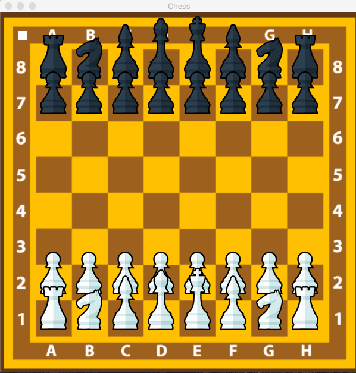
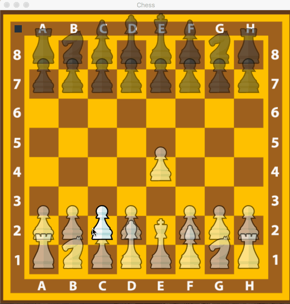
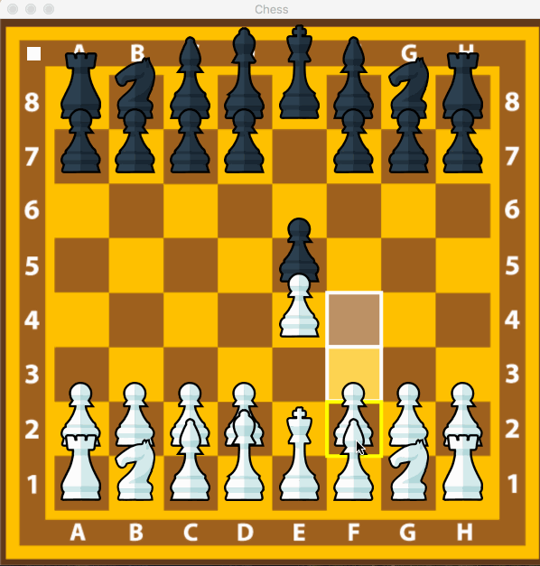
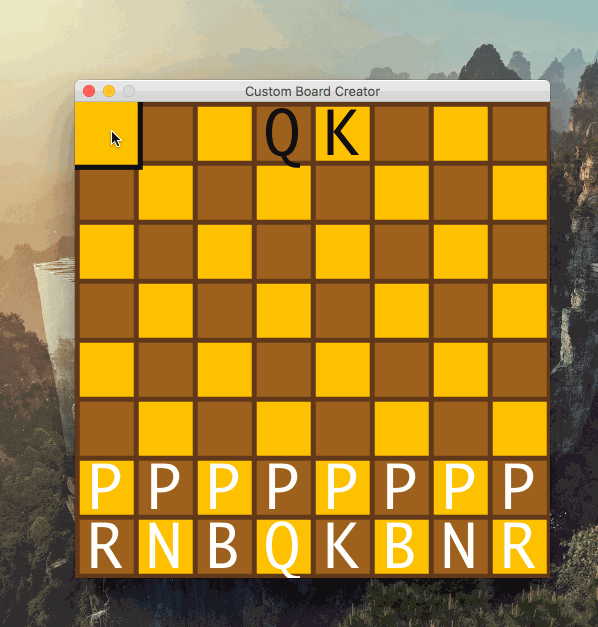
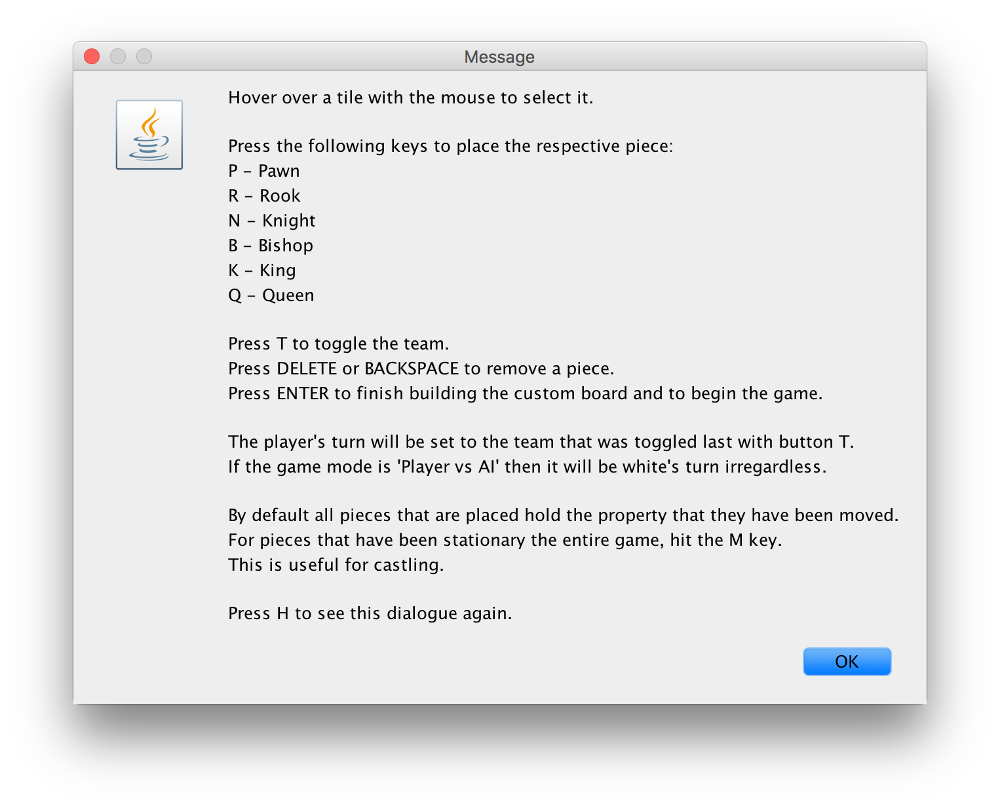
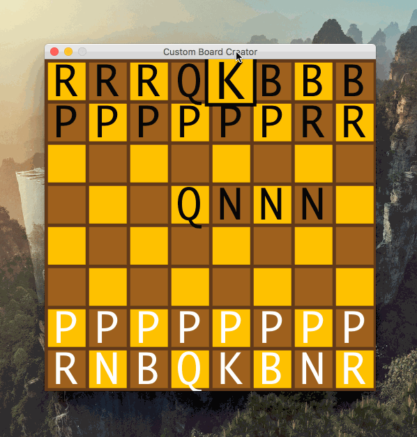

# Chess
The classic strategy board game.

## Features
Left click selects and moves the chess pieces. Right click un-selects a chess piece.



F1 toggles piece transparency when hovered on. This is for distinguishing overlapping pieces.



F3 toggles displaying possible locations a piece can move to.



The other features can be seen in the readme.txt.

## Custom Board

Move the mouse over a tile and press the first letter of a piece to place it. Press T to toggle the team.



Press H to see the help menu for details on how to use the custom board creator.



Press enter to start the game with the custom board.



## Usage
```
Usage:
  java Controller.Window [mode] [ply] [custom]

Parameters:
  [mode]     'pvp' for Player vs. Player.
             'avp' for Player vs. AI.
  [ply]      Numerical value for the AI's ply.
             This value is ignored for pvp mode.
  [custom]   'true' to create a custom board.
             'false' to go with the default board.

Examples:
  java Controller.Window avp 4 false
  java Controller.Window pvp 0 true
```

## Bugs

Having some issues with detecting stalemates.
